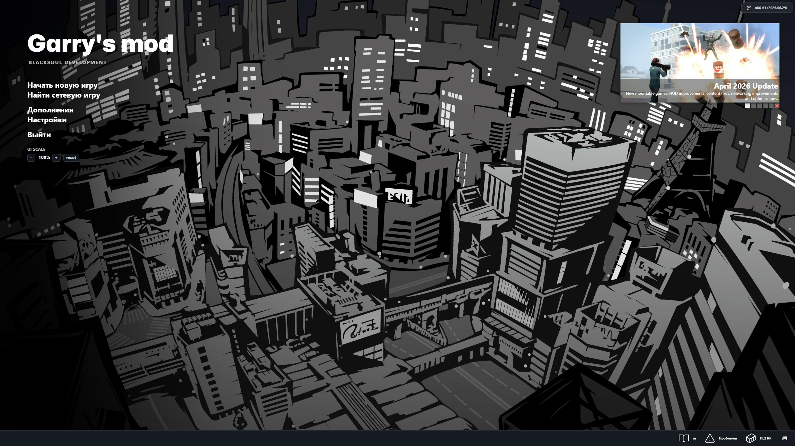

# BlackSoul Garry's Mod GitHub Theme

Готовый набор файлов для Garry's Mod в темной GitHub-like стилистике. Основа взята из проекта https://github.com/JWalkerMailly/Derma-Github-Theme.

## Превью

## Что меняется

Папка `garrysmod` включает кастомные файлы для:

- `html` — главное меню, страницы «Начать новую игру», «Серверы», loading HTML;
- `backgrounds` — фоны главного меню;
- `gamemodes/base/backgrounds/bg.jpg` — темный fallback-фон для ранней загрузки;
- `gamemodes/sandbox/backgrounds` — фоны splash/loading экранов sandbox;
- `gamemodes/sandbox/logo.png` и `gamemodes/sandbox/1logo.png` — splash-логотип BlackSoul;
- `materials/console` — темный Source/engine background для загрузки;
- `materials/resource/SourceScheme.res` — темная схема для раннего экрана запуска игры;
- `resource/SourceScheme.res` — темная Source/VGUI тема и шрифты;
- `resource/Mona-Sans.ttf` и `resource/SourceCodePro-VariableFont_wght.ttf`;
- `addons/Derma-Github-Theme-1.0.0` — темная тема для Derma/Spawnmenu.

## Установка

1. Полностью закрой Garry's Mod.
2. Открой папку игры: `...\Steam\steamapps\common\GarrysMod\`.
3. Скопируй папку `garrysmod` из этого репозитория прямо в каталог `GarrysMod`.
4. Подтверди замену файлов.
5. Не удаляй свою папку `garrysmod\html` перед копированием — важно вставлять файлы поверх, чтобы не потерять штатные JS-файлы меню.
6. Запусти Garry's Mod заново.

## Если Steam снова вернул стандартную тему

После Verify Integrity, смены ветки beta/dev/x86-x64 или обновления игры Steam может снова вернуть стандартные файлы. В этом случае достаточно повторить установку по инструкции выше.

